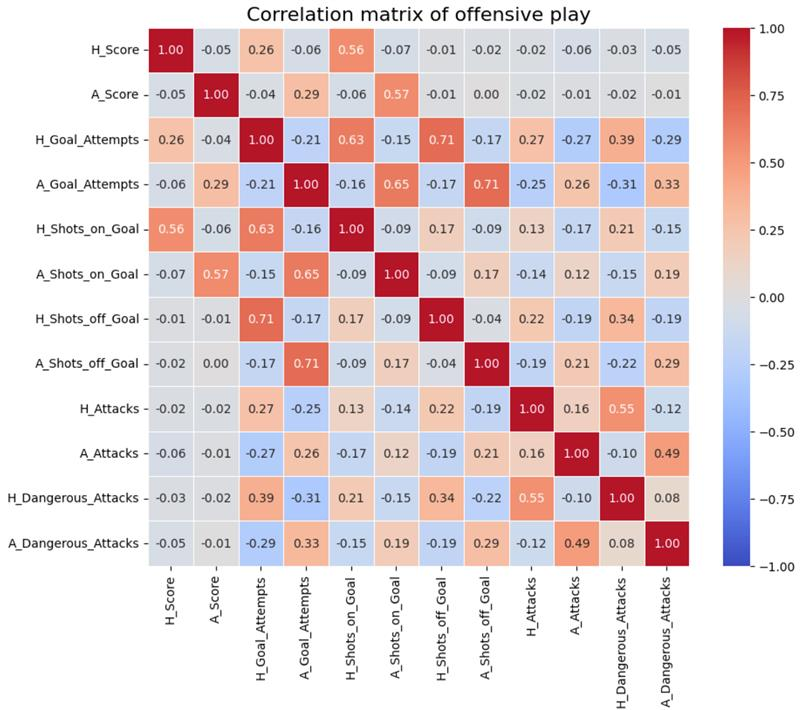

# analyza-futbalovych-zapasov
## Úvod

V našej práci sme sa zamerali na analýzu dát, ktoré obsahujú informácie o zápasoch hraných v 18-tich európskych ligách. Naše dáta pochádzajú z webstránky [Kaggle](https://www.kaggle.com/datasets/bastekforever/complete-football-data-89000-matches-18-leagues/data)
 .

Otázky, ktoré sme si pri analýze kládli:

* Ako medzi sebou súvisia niektoré parametre zápasu (napr. počet strelených gólov domácich vs počet ofenzívnych akcií domácich) ?
* Aké predikčné modely, dokážu lepšie predikovať výsledky futbalových zápasov?
* Ktoré parametre sú najdôležitejšie pri predikovaní výsledku zápasu?
* Vieme iba na základe parametrov zápasu určiť kvalitu ligy?
* Sú predzápasové kurzy dobrým indikátorom výhry tímu?
* Ktoré tímy sú si výkonmi v zápasoch podobné?
* Má tím, ktorý vyhráva po prvých 15 minútach signifikantne vyššiu šancu na výhru?
* Ktoré tímy majú ofenzívny, obranný alebo vyvážený štýl hry?
* Majú tímy lepšie parametre hry, ak hrajú na domácom ihrisku?
* Ktoré tímy dosahujú výkony, ktoré sa líšia v závislosti od konkrétneho roku?

## Premenné vyskytujúce nachádzajúce sa v našom dátovom súbore
Spolu je 96 tisíc riadkov a 56 stĺpcov. Veľa riadkov obsahuje chýbajúce dáta

| **#** | **Parameter**            | **Popis**                                                                                   |
|-------|--------------------------|---------------------------------------------------------------------------------------------|
| 1     | **League**               | Súťaž alebo šampionát, ktorého je zápas súčasťou (napr. Premier League, La Liga).           |
| 2     | **Home**                 | Názov tímu, ktorý hrá na svojom štadióne/poli.                                              |
| 3     | **Away**                 | Názov tímu, ktorý hosťuje/súperí.                                                           |
| 4     | **INC**                  | Interný kód alebo indikátor súvisiaci so zápasom (napr. stav zápasu alebo jedinečné ID).    |
| 5     | **Round**                | Konkrétna fáza alebo „hrací deň“ v sezóne/súťaži (napr. 5. kolo).                          |
| 6     | **Date**                 | Kalendárny dátum, kedy sa zápas odohral.                                                   |
| 7     | **Time**                 | Čas začiatku zápasu.                                                                       |
| 8     | **H_Score**              | Celkový počet gólov, ktoré strelil domáci tím na konci zápasu (konečné skóre).             |
| 9     | **A_Score**              | Celkový počet gólov, ktoré strelil hosťujúci tím na konci zápasu (konečné skóre).          |
| 10    | **HT_H_Score**           | Počet gólov, ktoré strelil domáci tím do polčasu.                                          |
| 11    | **HT_A_Score**           | Počet gólov, ktoré strelil hosťujúci tím do polčasu.                                       |
| 12    | **WIN**                  | Kto vyhral zápas („Home“ = 1, „Away“ = -1, „Draw“ = 0).                                    |
| 13    | **H_BET**                | Kurzy na výhru domáceho tímu pred začiatkom zápasu.                                        |
| 14    | **X_BET**                | Kurzy na remízu pred začiatkom zápasu.                                                    |
| 15    | **A_BET**                | Kurzy na výhru hosťujúceho tímu pred začiatkom zápasu.                                     |
| 16    | **WIN_BET**              | Výsledok zápasu v stávkových podmienkach (ktorý kurz „vyhral“).                            |
| 17    | **OVER_2.5**             | Indikuje, či celkový počet gólov v zápase prekročil 2,5 (áno/nie).                         |
| 18    | **OVER_3.5**             | Indikuje, či celkový počet gólov v zápase prekročil 3,5 (áno/nie).                         |
| 19    | **H_15**                 | Či domáci tím viedol v 15. minúte (pravda/nepravda).                                       |
| 20    | **A_15**                 | Či hosťujúci tím viedol v 15. minúte (pravda/nepravda).                                    |
| 21    | **H_45_50**              | Či domáci tím viedol okolo 45.–50. minúty (pravda/nepravda).                               |
| 22    | **A_45_50**              | Či hosťujúci tím viedol okolo 45.–50. minúty (pravda/nepravda).                            |
| 23    | **H_90**                 | Či domáci tím viedol v 90. minúte (na konci zápasu) (pravda/nepravda).                     |
| 24    | **A_90**                 | Či hosťujúci tím viedol v 90. minúte (na konci zápasu) (pravda/nepravda).                  |
| 25    | **H_Missing_Players**    | Počet hráčov domáceho tímu, ktorí nemohli hrať.                                            |
| 26    | **A_Missing_Players**    | Počet hráčov hosťujúceho tímu, ktorí nemohli hrať.                                         |
| 27    | **Missing_Players**      | Celkový počet chýbajúcich hráčov (kombinácia domáceho a hosťujúceho tímu).                 |
| 28    | **H_Ball_Possession**    | Percento času, počas ktorého mal domáci tím kontrolu nad loptou.                           |
| 29    | **A_Ball_Possession**    | Percento času, počas ktorého mal hosťujúci tím kontrolu nad loptou.                        |
| 30    | **H_Goal_Attempts**      | Celkový počet pokusov (striel) domácim tímom na skórovanie.                                |
| 31    | **A_Goal_Attempts**      | Celkový počet pokusov (striel) hosťujúcim tímom na skórovanie.                             |
| 32    | **H_Shots_on_Goal**      | Počet striel domácim tímom, ktoré smerovali na bránu.                                      |
| 33    | **A_Shots_on_Goal**      | Počet striel hosťujúcim tímom, ktoré smerovali na bránu.                                   |
| 34    | **H_Attacks**            | Počet ofenzívnych akcií domáceho tímu považovaných za „útoky“.                             |
| 35    | **A_Attacks**            | Počet ofenzívnych akcií hosťujúceho tímu považovaných za „útoky“.                          |
| 36    | **H_Dangerous_Attacks**  | Útoky domáceho tímu, ktoré mali vysokú šancu na gól.                                       |
| 37    | **A_Dangerous_Attacks**  | Útoky hosťujúceho tímu, ktoré mali vysokú šancu na gól.                                    |
| 38    | **H_Shots_off_Goal**     | Strely domáceho tímu, ktoré úplne minuli bránu.                                            |
| 39    | **A_Shots_off_Goal**     | Strely hosťujúceho tímu, ktoré úplne minuli bránu.                                         |
| 40    | **H_Blocked_Shots**      | Strely domáceho tímu zablokované obrancami pred dosiahnutím brány.                         |
| 41    | **A_Blocked_Shots**      | Strely hosťujúceho tímu zablokované obrancami.                                             |
| 42    | **H_Free_Kicks**         | Počet voľných kopov pridelených domácemu tímu.                                             |
| 43    | **A_Free_Kicks**         | Počet voľných kopov pridelených hosťujúcemu tímu.                                          |
| 44    | **H_Corner_Kicks**       | Počet rohových kopov pridelených domácemu tímu.                                            |
| 45    | **A_Corner_Kicks**       | Počet rohových kopov pridelených hosťujúcemu tímu.                                         |
| 46    | **H_Offsides**           | Počet ofsajdov domáceho tímu.                                                              |
| 47    | **A_Offsides**           | Počet ofsajdov hosťujúceho tímu.                                                           |
| 48    | **H_Throw_in**           | Celkový počet vhadzovaní vykonaných domácim tímom.                                         |
| 49    | **A_Throw_in**           | Celkový počet vhadzovaní vykonaných hosťujúcim tímom.                                      |
| 50    | **H_Goalkeeper_Saves**   | Počet záchran brankára domáceho tímu.                                                     |
| 51    | **A_Goalkeeper_Saves**   | Počet záchran brankára hosťujúceho tímu.                                                  |
| 52    | **H_Fouls**              | Počet faulov, ktorých sa dopustil domáci tím.                                              |
| 53    | **A_Fouls**              | Počet faulov, ktorých sa dopustil hosťujúci tím.                                           |
| 54    | **H_Yellow_Cards**       | Počet žltých kariet udelených hráčom domáceho tímu.                                        |
| 55    | **A_Yellow_Cards**       | Počet žltých kariet udelených hráčom hosťujúceho tímu.                                     |
| 56    | **Game Link**            | Hyperlink alebo odkaz na podrobné informácie o zápase.                                     |

## Exploratívna analýza

  
  
  

Z odhadu hustoty rozdelenia histogramom usudzujeme, že rozdelenie je symetrické pre tímy domácich aj tímy hostí, pričom sa nápadne podobá na normálne rozdelenie. Platí, že medián tímov domácich je vyšší ako medián tímov hostí. Tímy hostí majú aj nižšie minimum.

 
  
  

V porovnaní s rozdeleniami útokov sú rozdelenia nebezpečných útokov pozitívne zošikmené.

 
  
  

Rozdelenie pre parameter držania lopty vyzerá byť symetrické.

 
  
  
 

Rozdelenia sú pri všetkých kurzoch pozitívne zošikmené, čo môže byť spôsobené tým, že pred zápasom často existuje jasný favorit na výhru resp. sa stretávajú tímy, z ktorých jeden má historicky výrazne lepšie výkony.

## Analýza korelácie jednotlivých premenných

V našom dátovom súbore sa nachádzajú údaje, ktoré vystihujú ofenzívnu a defenzívnu hru tímov.
Medzi defenzívne parametre patria:

*   Počet žltých kariet
*   Počet červených kariet
*   Počet zblokovaných striel
*   Počet úspešných brankárskych zákrokov

Medzi ofenzívne parametre patria:

* Počet gólov
* Počet gólových pokusov
* Počet ofenzívnych akcií
* Počet nebezpečných ofenzívnych akcií
* Počet gólových pokusov
* Počet striel, čo minuli bránu
* Počet striel, čo smerovali na bránu

Pre ofenzívne a defenzívne parametre vykreslíme zvlášť korelačné matice.

 
 

Z korelačnej matice defenzívnej hry  možno usudzovať nasledovné závery:
*   Ak tím viac fauluje, tím dostáva viac žltých kariet.
*   Ak domáci tím pácha zvýšené množstvo faulov, potom sa dá očakávať, že viac faulov bude páchať aj hosťujúci tím.
*   Ak má jeden tím viac úspešných zákrokov brankára, potom druhý tím blokuje viac striel. Toto sa dá vysvetliť tým, že ak tím zvolí ofenzívnu stratégiu (resp. striela viac striel, ktoré druhý tím musí blokovať), potom jeho defenzíva je oslabená a musí sa viac spoliehať na zákroky brankára.

Z korelačnej matice ofenzívnej hry možno usudzovať nasledovné závery:
* Ak tím strieľa viac gólov, potom má viac gólových pokusov aj striel smerujúcich na bránu.
* Čím viac sa tím pokúša stieľať góly, tým väčší bude mať počet striel, ktoré budú smerovať na bránu, ako aj striel, ktoré budú smerovať mimo brány.
* Ak bude tím viac útočiť, tak bude mať aj vyšší počet gólových pokusov.
* Čím viac bude mať jeden tím gólových pokusov, tým menej bude mať druhý tím ofenzívnych akcií (pri gólových pokusoch súpera musí prejsť do defenzívy)

## Analýza pre  tímy v rámci jednej ligy

V našom dátovom súbore sa nachádzajú dáta pre zápasy z 18-tich európskych líg. Tieto ligy sa dajú rozdeliť do dvoch skupín:

  1. Prvoligové ligy
    - Premier League
    - Bundesliga
    - LaLiga
    - Ligue 1
    - Serie A
    - Eredivisie
    - Liga Portugal
    - Super Lig
    - PKO BP Ekstraklasa
    - Jupiler League
  2. Nižšie ligy
    - Championship
    - 2.Bundesliga
    - LaLiga 2
    - Ligue 2
    - Serie B
    - Fortuna 1. Liga
    - League One
    - League Two

V tejto časti dátovej analýzy sa pozrieme na to, aký výkon podávajú tímy v rámci jednotlivých líg. Je potrebné uvedomiť si, že je scestné porovnávať tímy z rozličných líg. Môže totiž nastať nasledovná situácia. Tím z nižšej ligy bude mať lepšiu výkonnosť doma aj vonku ako tím z prvej ligy. Nemusí to však nutne znamenať, že tím je lepší, resp. výkonnejší. Tím z vyššej ligy má totiž ťažších súperov a na to naše dáta neberú ohľad.

### Reprezentácia výkonnosti jednotlivých tímov

Výkonnosť tímov budeme reprezentovať ako jednu hodnotu, ktorá je určená nasledovnými parametrami:

*   percento vyhratých zápasov
*   priemerný počet gólov za zápas
*   priemerný počet gólových pokusov za zápas
*   priemerné percentuálne držanie lopty tímu v zápasoch

Parametre sa vyberali s úmyslom zachovať čo najväčší počet dát o zápasoch a zároveň získať čo najvyšší počet parametrov, ktoré by pozitívnym spôsobom vplývali na výkonnosť. Túto analýzu sme realizovali na 51868 dátach.

Hodnotu vypočítame pomocou PCA pre zápasy hrané na domácom aj pre zápasy hrané na cudzom ihrisku. Získame tak dve hodnoty reprezentujúce mieru výkonnosti, pričom vyššie hodnoty výkonnosti znamenajú výkonnejší, resp. lepší tím.

### Vykreslenie výkonnosti jednotlivých tímov
 Hodnoty vykreslíme pomocou interaktívneho scatterplotu pre jednotlivé ligy aj pre všetky ligy naraz. Vykreslenie scatterplotu pre ligu sa dá meniť pomocou interaktívneho dropdown menu. Na vykreslených scatterplotoch je možné pozorovať nasledujúce javy:

*   Tímy z nižších súťaží majú menšie hodnoty pre výkonnosť
*   Tímy z vyšších líg majú hodnoty výkonnosti viac rozptýlené
*   Tímy z vyšších súťaží majú často niekoľko odľahlých hodnôt, ktoré reprezentujú nadmerne výkonné tímy. Týmto spôsobom sa dajú  jednoducho určiť najúspešnejšie tímy v danej lige  (napr. Barcelona a Real Madrid sú najúspešnejšie tímy v histórii LaLigy).
*   Nižšie ligy majú väčší podiel tímov, ktoré majú nižšiu výkonnosť

V grafe, na ktorom sa nachádzajú všetky ligy je možné odpozorovať aj kvalitu jednotlivých líg napr. medzi najvýkonnejšími tímami spomedzi všetkých líg sa nachádzajú iba prvoligové tímy.

Možné dezinterpretácie grafu:
* Tím s nižšou hodnotou výkonnosti je vždy horší (Toto tvrdenie platí iba v rámci ligy, nie celkovo. Parametre, z ktorých bola výkonnosť vypočítaná totiž závisia od kvality súpera, pričom platí, že súperi vo vyšších ligách sú silnejší.)
* Hodnoty výkonnosti pre zápasy hrané na domácom a zápasy hrané na cudzom ihrisku sú ekvivalentné. Nie je, to pravda, pretože pca, boli v tomto prípade rátané zvlášť. Preto komponenty nadobúdajú podobné, ale predsa rozdielne hodnoty. Preto z grafu nie je vhodné vyvodzovať tvrdenia o tom, že tímom sa ne/darí viac na domácom ihrisku. Na to bude v našej analýze slúžiť samostatná časť.

Možné príčiny javov sledovaných na grafe:
* Všetky parametre z ktorých sa počíta výkonnosť sú vyššie pre prvoligové tímy. Prvoligové tímy majú väčšiu intenzitu hry, strieľajú viac gólov.
* Rozptýlenosť hodnôt vo vyšších ligách značne ovplyvňujú odľahlé hodnoty.

|PCA| Percento vyhratých zápasov      | Priemerný počet gólov | Priemerný počet gólových pokusov | Priemerné percenuálne držanie lopty|
|--------------|-------|---------|---------|--------|
| Zápasy hrané na domácom ihrisku | 0.53102988   |0.51703984      | 0.48379936    | 0.46541944|
| Zápasy hrané na cudzom ihrisku| 0.51727833 |  0.54131389      | 0.47976417     |0.45741528 |

 

## Hierarchické zhlukovanie

Rovnaké parametre, ktoré sme použili na vypočítanie PCA reprezentujúceho výkonnosť (t.j. percento vyhratých zápasov, priemerný počet gólov za zápas, priemerný počet gólových pokusov za zápas, priemerné percentuálne držanie lopty tímu v zápasoch), využijeme aj na vytvorenie dendrogramu tímov pre jednotlivé ligy. Dendrogram slúži ako vizualizácia hierarchického zhlukovania, kde sa tímy zhlukujú na základe ich podobnosti.

Tímy, ktoré sú si najviac podobné, sa spájajú v nižších úrovniach dendrogramu, kde je ich vzdialenosť medzi zhlukmi najmenšia. (Napr. úspešné tímy Premier league Chelsea, Liverpool a Manchester city sú spolu pospájané na prvej až druhej úrovni).

 

## Testovanie hypotéz

V tejto časti testujeme hypotézu, či existuje nejaká signifikantná závislosť medzi tým, kto vedie v prvých 15 minútach hry a finálnym skóre zápasu.

- H0: neexistuje súvislosť medzi týmito dvomi premennými
- H1: existuje signifikantná súvislosť

Z dát si najskôr vyfiltrujeme hry, ktoré nemali vyrovnané skóre v 15 minúte a ani neskončili remízou. Následne zostrojíme kontingenčnú tabuľku ktorá obsahuje počty pre jednotlivé stavy:
* 15 minúte vyhrával tím 'Home' a vyhral
* 15 minúte vyhrával tím 'Home' a vyhral tím 'Away'
* 15 minúte vyhrával tím 'Away' a vyhral
* 15 minúte vyhrával tím 'Away' a vyhral tím 'Home'

Hypotézu testujeme pomocou Chí-kvadrát testu s alpha = 0.05. P-hodnota vyšla 0.0, takže H0 zamietame a môžme potvrdiť, že skóre v 15 minúte má veľmi výrazný vplyv na konečný výsledok.

 

Testujeme, pre ktoré tímy existuje signifikantná závislosť medzi rok a počtami výhier/prehier.

- H0: neexistuje signifikantná závislosť medzi rokom a počom výhier
- H1: existuje závislosť medzi týmito premennými

Pre každý tím osobitne zostrojím kontingenčnú tabuľkú, ktorá teraz pozostáva z riadkov, kde sú roky a stĺpce udávajú počet výrier/prehier a znova použijeme Chí-kvadrát test. Ďalej sa môžme bližšie pozrieť na tímy, ktoré majú najviac odohraných zápasov a ktorým vyšla extrémne malá p-hodnota < 0.001, sem patrí Bolton, Sunderland a Toulouse. Po vizualizácií ich skóre pomocou bar grafov si môžme všimnúť, že pre Sunderland a Toulouse platí, že do roku 2019/2020 zvykli väčšinu svojich zápasov prehrávať, no potom vidíme výrazné zlepšenie. Pre Bolton je výrazné zhoršenie medzi rokmi 2015-2019.

 
 

## Rozhodovacie stromy a lesy
V tejto časti sa snaíme predikovať výsledok zápasu pomocou rozhodovacieho stromu. Základný dataset obsahuje ako premenné počty jednotlivých udalostí, ako napríklad počet útokov, vhadzovaní, faulov za jednotlivé tímy. Tieto premenné trasformujeme na relatívny počet, teda pomer medzi domácim tímom a hosťami. Následne využijeme hodnoty jedného tímu ako vstupy pre model rozhodovacieho stromu. Najlepšie predikcie dostávame pri maximálnej hĺbke 5, pri vyššej dochádza k pretrénovaniu a model horšie predikuje na validačnej vzorke.

 

Výsledné predikcie na validačnej vzorke dosahujú úspešnosť približne 60-65%. Táto úspešnosť sa mierne zvýši, keď namiesto jednoduchého rozhodovacieho stromu použijeme metódu náhodných lesov. Náhodné lesy, kombinujú viacero rozhodovacích stromov, čo pomáha zlepšiť robustnosť modelu a znižuje riziko pretrénovania.

 
 

## Záver

* Ktoré parametre sú najdôležitejšie pri predikovaní výsledku zápasu?
* Vieme iba na základe parametrov zápasu určiť kvalitu ligy?
* Sú predzápasové kurzy dobrým indikátorom výhry tímu?
* Ktoré tímy sú si výkonmi v zápasoch podobné?
* Má tím, ktorý vyhráva po prvých 15 minútach signifikantne vyššiu šancu na výhru?
* Ktoré tímy majú ofenzívny, obranný alebo vyvážený štýl hry?
* Majú tímy lepšie parametre hry, ak hrajú na domácom ihrisku?
* Ktoré tímy nehrajú rovnako dobre počas všetkých období, ale ich úspešnosť závisí od roku?

### Odpovede na otázky a výsledky analýzy

Z našej analýzy sme zistili, že uvedené predikčné modely predikujú výsledky zápasov s uvedenou presnosťou:

|Model| Accuracy |
|--------------|-------|
| Predikčné stromy |  64.37%  |
| Náhodné lesy| 66.18% |
| Neurónové siete| 72.77% |
|Logistická regresia| 72.32% |  

Je potrebné poznamenať, že pre správnosť porovnávania jednotivých modelov, boli modely trénované pomocou rovnakých parametrov. Zároveň musíme, dodať, že sme predikčné modely trénovali aj vyhodnocovali na dátach zo zápasov, ktoré sa neskončili remízou. Z výsledkov je očakávané, že najlepšie budú výsledky zápasov predikovať neurónové siete a najhoršie predikčné lesy.

Pomocou pca sme boli schopný porovnávať výkonnosti jednotlivých tímov a na základe týchto poznatkov vypozorovať, ktoré z európskych líg majú najvyššiu kvalitu. Potom sme tímy jednotlivých líg hierarchických zhlukovaním vykreslili v dendrograme.

Okrem toho sme využili aj zhlukovaciu metódu k-means, ktorá tímy rozdelila do skupín, podľa štýlu hry na ofenzívne a dominantné tímy, obranné a slabšie tímy a vyvážené a disciplinované tímy.

Pomocou štatistických testov sme overili nasledovné hypotézy, či má tím, ktorý vyhráva v prvých 15 minútach vyššiu pravdepodobnosť výhry. Zistili sme, že táto hypotéza platí. Overili sme aj hypotézu o tom, či sa hra niektorých tímov počas rokov zlepšuje alebo zhoršuje. Hypotéza o zlepšovaní a zhoršovaní hry bola prijatá iba pre niektoré z tímov. Väčšina tímov však hrá v priebehu rokov rovnako dobre.

V analýze sme sa zamerali aj na správnosť stávkovacích kurzov. Ak sme výhru a prehru modelovali iba pomocou kurzov získali sme 67% presnosť. Znamená to, že väčšinou tím s vyšším kurzom vyhrá.

### Výzvy, ktorým sme čelili:

*   veľký počet chýbajúcich dát
*   vytvorenie jedeného interaktívneho graf pre viacero líg
*   interpretácia niektorých výsledkov analýz

